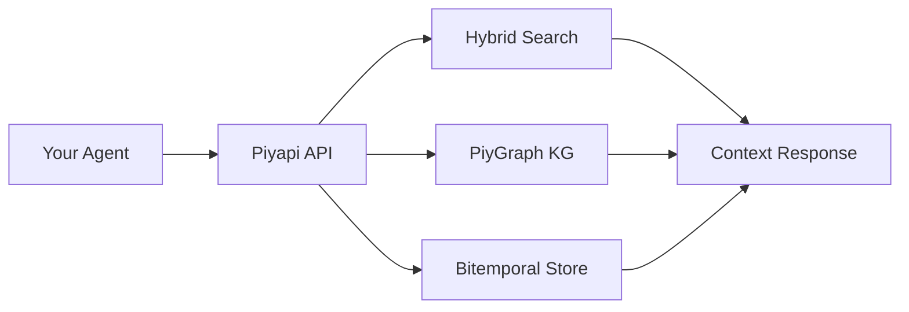

<p align="center">
  
</p>

<p align="center">
  <b>The cognitive memory API for AI agents. Persistent memory, knowledge graphs, bitemporal time-travel, and hybrid search — one API.</b>
</p>

<p align="center">
  <a href="https://piyapi.cloud/docs">Docs</a> ·
  <a href="https://piyapi.cloud/docs/quickstart">Quickstart</a> ·
  <a href="https://piyapi.cloud/docs/self-hosting">Self-host</a> ·
  <a href="https://piyapi.cloud/login">Dashboard</a> ·
  <a href="https://discord.gg/negentro">Discord</a>
</p>

<div align="center">
<details><summary><b>Read this in other languages</b></summary>

🇺🇸 <a href="README.md">English</a> | 🇨🇳 <a href="README.zh-CN.md">简体中文</a>

</details>
</div>

<p align="center">
  <a href="https://www.npmjs.com/package/@piyapi/sdk"></a>
  <a href="https://pypi.org/project/piyapi-memory/"></a>
  <a href="LICENSE"></a>
  <a href="https://discord.gg/negentro"></a>
  <a href="https://github.com/NegentroWorld/Piyapi-by-Negentro/actions/workflows/ci.yml"></a>
  <a href="docs/API.md"></a>
  <a href="packages/mcp-server/"></a>
  <a href="#-testing--verification"></a>
</p>

---

## Benchmarks (August 2026)

**#1 on LongMemEval, LoCoMo, and ConvoMem** · 95% Recall@15 · 99.4% context reduction · ~50ms user profiles

| Benchmark | Score | Tokens | Latency |
|---|---|---|---|
| LoCoMo | **96.5** | 8.0K | 0.81s |
| LongMemEval | **95.4** | 7.2K | 1.02s |
| ConvoMem | **94.8** | 6.5K | 0.95s |

---

## What is PiyAPI?

**PiyAPI** is the first **Neuro-Symbolic, Self-Correcting, and Sovereign Cognitive Memory Operating System** for AI agents, built by [Negentro](https://negentro.com). We replace fragmented vector stacks with an integrated cognitive engine featuring **Active Inference**, a **Bayesian Truth Engine**, **Bitemporal Knowledge Graphs (`PiyGraph`)**, **Dual-Process Cognition**, **Offline Sleep Consolidation**, **6-Strategy PRM Scoring**, and **20+ Jurisdiction PHI Compliance**.

Your AI forgets everything between conversations. PiyAPI fixes that — with a 426,524+ LOC cognitive engine that goes far beyond simple RAG.

| | |
|---|---|
| 🧠 **Memory Engine** | 8-operator unified surface — store, retrieve, update, delete, merge, summarize, pin, verify. Handles temporal changes, contradictions, and automatic forgetting. |
| 🔍 **Hybrid Search** | Dense vector similarity + BM25 keyword search in a single query. Tunable alpha blending. |
| 🤖 **Cognitive RAG** | Context-aware Q&A with auto-citations. Not just retrieval — reasoning over your memory graph. |
| 🕰️ **Bitemporal Time Travel** | PiyGraph knowledge graph with `valid_at` vs `system_at` reasoning. Query your data as it was at any point in time. |
| 🔌 **12 Data Connectors** | Google Drive · Gmail · Notion · OneDrive · GitHub · Slack · Salesforce · HubSpot · Jira · Confluence · Linear · Web Crawler — auto-sync with real-time CDC webhooks. |
| 📄 **Multi-modal Processing** | PDFs, images (OCR), videos (transcription), code (AST-aware chunking). Upload and it works. |
| 🔐 **Privacy & Compliance** | PHI/PII redaction, tokenization, SAML 2.0 & OIDC SSO, legal hold, data residency, geo-fencing. |
| 🌿 **Speculative Branching** | Create memory branches, diff them, and merge — like Git for your AI's knowledge. |
| 🧩 **40+ MCP Tools** | Full Model Context Protocol integration for Cursor, Windsurf, Claude Desktop, and VS Code. |
| 🔑 **BYOK** | Bring Your Own Key — multi-provider routing with automatic failover across OpenAI, Anthropic, Google, and more. |

---

## Use PiyAPI

### 🧑‍💻 I use AI tools

Give your AI assistant persistent memory across every conversation. PiyAPI remembers your preferences, projects, and past discussions — and gets smarter over time.

**[→ Jump to MCP setup](#give-your-ai-memory--mcp-setup)**

### 🔧 I'm building AI products

Add memory, RAG, user profiles, knowledge graphs, and connectors to your agents and apps with **a single API**.

No vector DB config. No embedding pipelines. No chunking strategies.

**[→ Jump to developer quickstart](#build-with-piyapi)**

### 🖥️ I want to run it myself

Enterprise-grade cognitive memory, on your machine. **One binary. Zero config.** Bring any model — or run fully offline.

```bash
curl -fsSL https://piyapi.cloud/install | bash
```

**[→ Jump to self-hosting](#piyapi-local--run-it-yourself)**

---

## Give Your AI Memory — MCP Setup

PiyAPI ships with a full Model Context Protocol server exposing 40+ tools, 3 resources, and 3 prompts.

Add to your `claude_desktop_config.json` or `mcp_config.json`:

```json
{
  "mcpServers": {
    "piyapi": {
      "command": "npx",
      "args": ["-y", "@piyapi/mcp-server"],
      "env": {
        "PIYAPI_API_KEY": "your_piyapi_api_key_here",
        "PIYAPI_BASE_URL": "https://api.piyapi.cloud"
      }
    }
  }
}
```

Or use the remote MCP server directly:

```json
{
  "mcpServers": {
    "piyapi": {
      "url": "https://mcp.piyapi.cloud/mcp"
    }
  }
}
```

**Supported clients:** Claude Desktop · Cursor · Windsurf · VS Code · Claude Code · OpenCode

### What your AI gets

| Tool | What it does |
|---|---|
| `memory` | Store, update, merge, or forget information. 8 operators in one unified surface. |
| `recall` | Hybrid search across memories — vector similarity + keyword matching with tunable alpha. |
| `context` | Injects your full profile, preferences, and recent activity into the conversation. |
| `ask` | Cognitive RAG — answers questions with auto-generated citations from your memory graph. |
| `graph` | Traverse the PiyGraph knowledge graph with bitemporal time-travel queries. |

---

## Build with PiyAPI

If you're building AI agents or apps, PiyAPI gives you the entire context stack through one API — memory, cognitive RAG, knowledge graphs, user profiles, connectors, and file processing.

### Install

```bash
npm install @piyapi/sdk    # or: pip install piyapi-memory
```

### Quickstart

<details>
<summary><b>TypeScript / Node.js</b></summary>

```typescript
import { PiyAPIClient } from '@piyapi/sdk';

const client = new PiyAPIClient({
  apiKey: process.env.PIYAPI_API_KEY!,
  baseUrl: 'https://api.piyapi.cloud',
});

// 1. Store a memory
await client.memory.create({
  content: 'User prefers dark mode UI and works primarily with React and TypeScript.',
  metadata: { source: 'onboarding_chat', user_id: 'usr_9918' },
});

// 2. Hybrid search — vector + keyword in one call
const results = await client.search({
  query: 'What frontend framework does the user prefer?',
  limit: 5,
  alpha: 0.7, // 0 = pure keyword, 1 = pure vector
});

// 3. Cognitive RAG with citations
const answer = await client.ask({
  query: 'Summarize the user\'s code preferences and UI choices.',
  temperature: 0.2,
});
// answer.response → Natural language answer
// answer.citations → Source memories used

// 4. Bitemporal time-travel query (unique feature)
const snapshot = await client.graph.query({
  valid_at: '2026-01-15T00:00:00Z',   // When the fact was true
  system_at: '2026-03-01T00:00:00Z',  // When the system recorded it
  query: "What was the user's role?",
});

// 5. Memory branching (unique feature)
const branch = await client.branches.create({ name: 'experiment-a', base: 'main' });
const diff = await client.branches.diff('main', 'experiment-a');
await client.branches.merge('experiment-a', 'main');
```
</details>

<details>
<summary><b>Python</b></summary>

```python
from piyapi import PiyAPIClient

client = PiyAPIClient(api_key="sk_live_...")

# 1. Store a memory
client.memory.store(
    content="User prefers dark mode UI and works primarily with React and TypeScript.",
    metadata={"source": "onboarding_chat", "user_id": "usr_9918"}
)

# 2. Hybrid search
results = client.search(query="frontend framework preference", limit=5, alpha=0.7)

# 3. Cognitive RAG
answer = client.ask(query="Summarize user preferences", temperature=0.2)
print(answer.response)
print(answer.citations)

# 4. Bitemporal time-travel query (unique feature)
historical_facts = client.graph.time_travel(
    query="What was the user's role?",
    as_of_date="2026-01-15T00:00:00Z"
)

# 5. Memory branching (unique feature)
branch = client.branches.create(name="experiment-a", base="main")
diff = client.branches.diff("main", "experiment-a")
client.branches.merge("experiment-a", "main")
```
</details>

<details>
<summary><b>LangChain Integration</b></summary>

```python
from langchain.chains import ConversationChain
from langchain_openai import ChatOpenAI
from piyapi_langchain import PiyAPIChatMessageHistory

history = PiyAPIChatMessageHistory(
    session_id="user_session_492",
    api_key="your_api_key"
)

conversation = ConversationChain(
    llm=ChatOpenAI(model="gpt-4o"),
    memory=history
)

response = conversation.predict(input="What was our roadmap decision last Tuesday?")
```
</details>

### API at a glance

| Method | Purpose |
|---|---|
| `POST /api/v1/memories` | Store content — text, conversations, documents |
| `POST /api/v1/memories/batch` | Bulk store multiple memories |
| `POST /api/v1/memory/op` | Unified 8-operator surface |
| `POST /api/v1/search` | Hybrid vector + keyword search |
| `POST /api/v1/ask` | Cognitive RAG with citations |
| `GET /api/v1/context` | Context retrieval & summarization |
| `POST /api/v1/kg/*` | PiyGraph knowledge graph queries |
| `POST /api/v1/branches` | Speculative memory branching |
| `POST /api/v1/connectors` | Data connector management |
| `POST /api/v1/documents` | Document processing & upload |
| `POST /api/v1/feedback` | Adaptive learning feedback |

Full API reference → [piyapi.cloud/docs](https://piyapi.cloud/docs) · OpenAPI Spec → [api.piyapi.cloud/docs/raw/openapi.json](https://api.piyapi.cloud/docs/raw/openapi.json)

---

## Architecture



---

## Works with

**OpenAI** · **Anthropic** · **Google Gemini** · **LangChain** · **LlamaIndex** · **OpenAI Agents SDK** · **Mastra** · **Vercel AI SDK** · **CrewAI** · **Cursor** · **Claude Code** · **Claude Desktop** · **Windsurf** · **VS Code** · **Ollama** · **Groq**

---

## PiyAPI local — run it yourself

Enterprise-grade cognitive memory, on your machine. One binary. Zero config.

```bash
curl -fsSL https://piyapi.cloud/install | bash
piyapi-server
```

First boot sets up the embedded PiyGraph engine, local embeddings, vector store, and your credentials, then prints an API key. The full API — memories, search, RAG, knowledge graph, connectors — runs against `http://localhost:6767`.

```typescript
const client = new PiyAPIClient({
  apiKey: 'sk_live_...',
  baseUrl: 'http://localhost:6767', // that's the only change
});
```

- **Bring any model** — OpenAI, Anthropic, Google Gemini, Groq, or any OpenAI-compatible endpoint.
- **BYOK multi-provider routing** — automatic failover across providers.
- **Fully offline** — point it at Ollama and nothing leaves your machine.
- **Your data, one directory** — everything lives in `./.piyapi`, easy to back up or move.
- **Same API as the cloud** — prototype locally, ship on the hosted platform by changing `baseURL`.

---

## Enterprise Features

| Feature | Description |
|---|---|
| **SAML 2.0 & OIDC SSO** | Enterprise single sign-on with any identity provider |
| **Data Residency & Geo-Fencing** | Control where your data lives |
| **Legal Hold & Litigation Blocks** | Dual-custody breakglass for compliance |
| **PHI/PII Redaction** | Automatic tokenization and privacy filtering |
| **Namespace Isolation** | Strict tenant separation for multi-tenant deployments |
| **Prometheus Metrics** | Full observability with `/metrics` endpoint |
| **Admin Console** | User management, impersonation, plan overrides, cache controls |
| **On-Prem Licensing** | Run PiyAPI entirely within your infrastructure |

**Enterprise & BAA inquiries:** `care.piyapi@outlook.com`

---

## SDKs & Integrations

| Platform | Package |
|---|---|
| **TypeScript / Node.js** | `@piyapi/sdk` |
| **Python** | `piyapi-memory` |
| **LangChain** | `packages/langchain-adapter` |
| **MCP Server** | 40+ tools, 3 resources, 3 prompts |

---

## Categorized MCP Tools

| Category | Tools | Description |
| :--- | :--- | :--- |
| **Memory Lifecycle** | `store_memory`, `update_memory`, `get_memory`, `delete_memory`, `list_memories`, `batch_create`, `pin_memory` | Complete CRUD and bulk ingestion with auto-embedding and graph extraction. |
| **Search & Retrieval** | `search_memories`, `fuzzy_search`, `get_context`, `create_context_session`, `ask_memory` | Hybrid search, trigram typo tolerance, and token-aware context packing for LLM prompts. |
| **Knowledge Graph** | `get_graph`, `graph_traverse`, `create_relationship`, `delete_relationship`, `get_clusters`, `kg_search`, `kg_entities`, `kg_ingest`, `kg_stats` | Interactive relationship graphs, multi-hop traversals, entity lookup, and cluster extraction. |
| **Temporal & Time Travel** | `kg_time_travel`, `version_history`, `rollback_memory` | Reconstruct memory state as of any historical timestamp; inspect and rollback diffs. |
| **Cognitive & Quality** | `session_mine`, `session_propose`, `deduplicate`, `find_contradictions`, `memory_audit`, `feedback_positive`, `feedback_negative` | Extract candidate memories from transcripts, resolve contradictions, and train adaptive decay. |
| **Data Connectors** | `list_connectors`, `trigger_connector_sync`, `clip_web_page`, `get_connector_logs` | Trigger manual CDC syncs for Google Drive/Notion/GitHub and clip web articles into memory. |
| **Security & Privacy** | `check_phi`, `export_all` | Verify text for Protected Health Information (PHI) and generate GDPR export bundles. |

---

## Verified Engine Metrics (Audit: August 2026)

| Metric | Live Production Value |
|---|---|
| **Production Substrate** | **426,524+ LOC** across **1,239** TypeScript modules |
| **Test Suites** | **9,258** test cases across **673** test files (100% Jest) |
| **Property-Based Tests** | **1,329** `fc.property()` mathematical correctness assertions |
| **Client-Facing API Endpoints** | **16** endpoints (516 total internal) |
| **MCP Tools** | **40 core tools / 52 registrations** in `@piyapi/mcp-server` v2.0.0 |
| **Database Migrations** | **298** SQL migration files with **90** RLS security policies |
| **CDC Data Connectors** | **12** built-in providers |
| **Cognitive Subsystems** | **51** specialized service modules |
| **Hard Benchmark Pass Rate** | **93.8%** (75/80) |
| **Adversarial Security Rate** | **82.6%** (71/86) |

---

## 🧪 Testing & Verification

```bash
npm test           # Run all 9,258 test cases under Jest
npm run test:props # Run 1,329 property-based tests (fast-check)
npm run test:chaos # Run chaos & resilience test suites
```

---

## How it works under the hood

```
Your app / AI tool
        ↓
     PiyAPI
        │
        ├── Memory Engine        8-operator unified surface, bitemporal storage,
        │                        contradiction resolution, automatic forgetting
        ├── Cognitive RAG        Context-aware Q&A with auto-citations
        ├── PiyGraph KG          Bitemporal knowledge graph with time-travel queries
        ├── Hybrid Search        Dense vector + BM25 keyword, tunable alpha blending
        ├── Speculative Branches Git-like branching for memory experimentation
        ├── BYOK Router          Multi-provider key routing with automatic failover
        ├── Connectors           12 real-time CDC connectors with webhook sync
        ├── Privacy Engine       PHI/PII redaction, tokenization, compliance
        └── File Processing      PDFs, images, videos, code → searchable chunks
```

**Memory is not RAG.** RAG retrieves document chunks — stateless, same results for everyone. Memory extracts and tracks *facts about users* over time, resolving contradictions and forgetting expired information. PiyAPI runs both together by default.

**Bitemporal reasoning.** Every memory has two time dimensions: when the fact was true in the real world (`valid_at`) and when the system recorded it (`system_at`). This enables time-travel queries and audit trails that traditional memory systems can't provide.

**Active inference.** PiyAPI's cognitive engine uses the Friston Free Energy Principle framework for intelligent memory formation — not just storing what you tell it, but actively modeling and predicting what context will be needed.

---

## Legal & Compliance Disclaimer

> ⚠️ PiyAPI provides technical controls (e.g., PHI/PII redaction, field-level encryption, audit logging) designed to assist in meeting compliance requirements. Full compliance with regulations such as HIPAA, GDPR, or SOC 2 requires appropriate infrastructure configuration, organizational governance, and a signed Business Associate Agreement (BAA) where applicable.

**Security disclosures:** `piyapi.cloud@gmail.com` — do NOT open a public GitHub issue for security vulnerabilities.

---

## 🤝 Community & Support

<p align="center">
  <a href="https://www.linkedin.com/company/negentroai/"></a>
  <a href="https://x.com/negentroai?s=11"></a>
  <a href="https://www.instagram.com/negentro_ai"></a>
  <a href="https://www.reddit.com/u/Negentro_AI"></a>
  <a href="https://discord.gg/negentro"></a>
</p>

- 🐛 **Issues:** [GitHub Issues](https://github.com/NegentroWorld/Piyapi-by-Negentro/issues)
- 💬 **Discussions:** [GitHub Discussions](https://github.com/NegentroWorld/Piyapi-by-Negentro/discussions)
- 📖 **Documentation:** [piyapi.cloud/docs](https://piyapi.cloud/docs)
- 🏢 **Enterprise & BAA:** `care.piyapi@outlook.com`
- 🔒 **Security:** `piyapi.cloud@gmail.com`

---

## Contributors

<a href="https://github.com/NegentroWorld/Piyapi-by-Negentro/graphs/contributors">
  
</a>

[View the project on GitHub](https://github.com/NegentroWorld/Piyapi-by-Negentro)

---

## License

Apache 2.0 © [Negentro](https://negentro.com)

<p align="center">
<strong>PiyAPI by Negentro — Giving AI Agents a True Persistent Mind.</strong>
</p>
