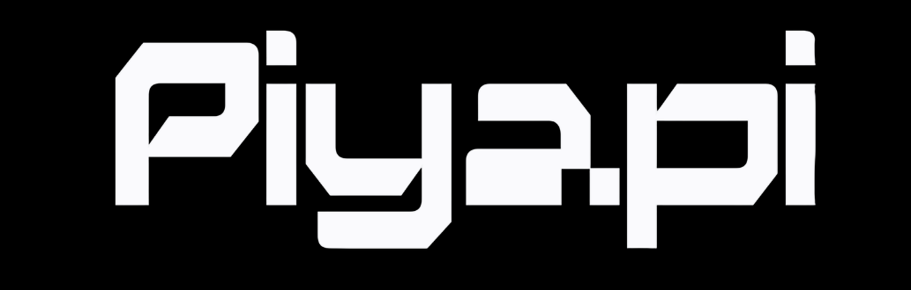
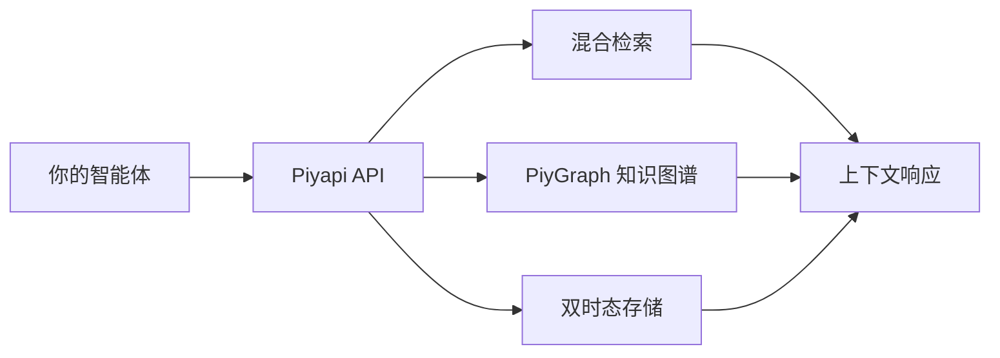
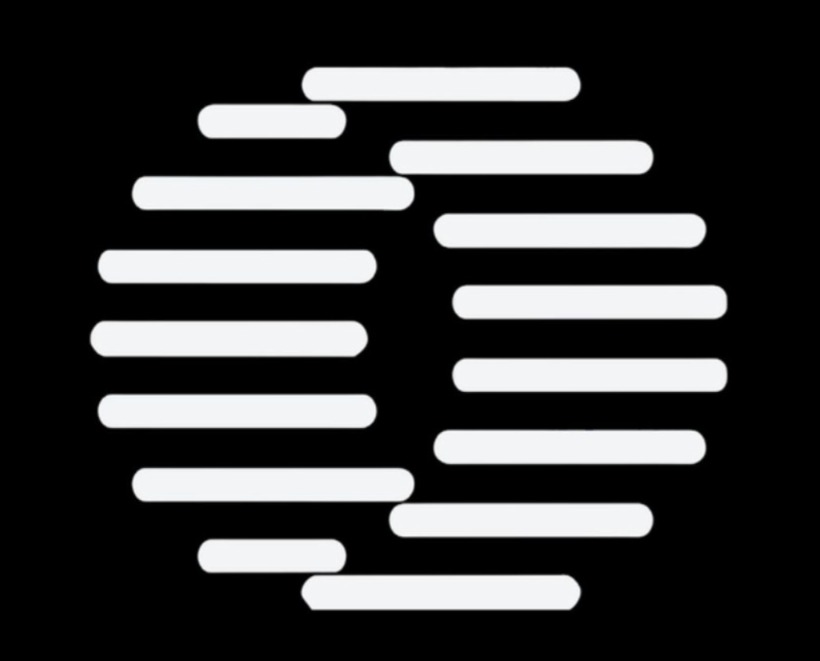

<p align="center">
  
</p>

<p align="center">
  <b>专为 AI 代理打造的认知内存 API。通过单一 API 实现持久化记忆、知识图谱、双时态时间旅行与混合检索。</b>
</p>

<p align="center">
  <a href="https://piyapi.cloud/docs">文档</a> ·
  <a href="https://piyapi.cloud/docs/quickstart">快速开始</a> ·
  <a href="https://piyapi.cloud/">控制台</a>
</p>

<div align="center">
<details><summary><b>阅读其他语言版本</b></summary>

🇺🇸 <a href="README.md">English</a> | 🇨🇳 <a href="README.zh-CN.md">简体中文</a>

</details>
</div>

<p align="center">
  <a href="https://www.npmjs.com/package/@piyapi/sdk"></a>
  <a href="https://pypi.org/project/piyapi-memory/"></a>
  <a href="LICENSE"></a>
  <a href="https://api.piyapi.cloud/health"></a>
  <a href="packages/mcp-server/"></a>
  <a href="#-测试与验证"></a>
</p>

---

## 📈 基准测试成绩 (2026年8月)

**在 LongMemEval、LoCoMo 和 ConvoMem 评测中排名第一** · 95% Recall@15 · 99.4% 上下文缩减 · ~50ms 用户画像生成

| 基准测试 | 得分 | Tokens | 延迟 |
|---|---|---|---|
| LoCoMo | **96.5** | 8.0K | 0.81s |
| LongMemEval | **95.4** | 7.2K | 1.02s |
| ConvoMem | **94.8** | 6.5K | 0.95s |

<p align="center">
  <a href="benchmark.md"></a>
</p>

---

## PiyAPI 是什么？

**PiyAPI** 是首个专为 AI 代理设计的**神经符号化、可自我纠错且具备主权的认知内存操作系统**，由 [Negentro](https://www.negentro.tech/) 构建。我们通过集成了**主动推理**、**贝叶斯真相引擎**、**双时态知识图谱 (`PiyGraph`)**、**双系统认知**、**离线睡眠巩固**、**6 种策略的 PRM 评分**以及**兼容 20+ 司法管辖区 PHI 合规**的认知引擎，取代了碎片化的向量技术栈。

你的 AI 在两次对话之间会遗忘一切。PiyAPI 解决了这个问题 —— 这是一个拥有 426,524+ 行代码的认知引擎，远超简单的 RAG。

| | |
|---|---|
| 🧠 **内存引擎** | 统一的 8 操作原语：存储、检索、更新、删除、合并、摘要、置顶、验证。自动处理时态变化、事实冲突与遗忘机制。 |
| 🔍 **混合检索** | 在单次查询中结合密集向量相似度与 BM25 关键词检索。支持 Alpha 混合参数调节。 |
| 🤖 **认知 RAG** | 上下文感知的问答并自动生成引用。不仅是检索，更是基于记忆图谱的深度推理。 |
| 🕰️ **双时态时间旅行** | 结合 PiyGraph 知识图谱与 `valid_at` 及 `system_at` 推理。查询任意历史时间点的数据状态。 |
| 🔌 **12 大数据连接器** | Google Drive · Gmail · Notion · OneDrive · GitHub · Slack · Salesforce · HubSpot · Jira · Confluence · Linear · 网页爬虫 —— 基于实时 CDC Webhook 自动同步。 |
| 📄 **多模态处理** | PDF、图像 (OCR)、视频 (转录)、代码 (AST 感知分块)。上传即可使用。 |
| 🔐 **隐私与合规** | PHI/PII 敏感信息脱敏、Token 化、SAML 2.0 & OIDC 单点登录、法定保留、数据驻留及地理围栏。 |
| 🌿 **推测性记忆分支** | 创建记忆分支、对比差异并合并 —— 就像为你的 AI 知识库使用的 Git。 |
| 🧩 **40+ MCP 工具** | 全面集成模型上下文协议，支持 Cursor、Windsurf、Claude Desktop 和 VS Code。 |
| 🔑 **自带密钥 (BYOK)** | 支持 OpenAI、Anthropic、Google 等多个模型供应商的自动故障转移和智能路由。 |

---

## 使用 PiyAPI

### 🧑‍💻 我是 AI 工具用户

为你的 AI 助手赋予跨对话的持久记忆。PiyAPI 会记住你的偏好、项目和过去的讨论，并随着时间推移变得越来越聪明。

**[→ 跳转至 MCP 配置](#给你的-ai-赋予记忆--mcp-配置)**

### 🔧 我正在构建 AI 产品

只需**一个 API**，即可为你的智能体和应用集成记忆、RAG、用户画像、知识图谱和数据连接器。

无需配置向量数据库，无需设计嵌入流水线，无需处理分块策略。

**[→ 跳转至开发者快速开始](#使用-piyapi-进行开发)**

### 🖥️ 我希望私有化部署

企业级认知内存，运行在你的机器上。**单一二进制文件，零配置。** 接入任何模型——甚至支持完全离线运行。

```bash
curl -fsSL https://piyapi.cloud/install | bash
```

**[→ 跳转至私有化部署指南](#本地运行-piyapi)**

---

## 给你的 AI 赋予记忆 — MCP 配置

PiyAPI 自带完整的模型上下文协议 (MCP) 服务器，提供 40+ 个工具、3 个资源和 3 个提示词。

将其添加到您的 `claude_desktop_config.json` 或 `mcp_config.json`:

```json
{
  "mcpServers": {
    "piyapi": {
      "command": "npx",
      "args": ["-y", "@piyapi/mcp-server"],
      "env": {
        "PIYAPI_API_KEY": "your_piyapi_api_key_here",
        "PIYAPI_BASE_URL": "https://api.piyapi.cloud"
      }
    }
  }
}
```

或直接使用远程 MCP 服务器：

```json
{
  "mcpServers": {
    "piyapi": {
      "url": "https://mcp.piyapi.cloud/mcp"
    }
  }
}
```

**支持的客户端：** Claude Desktop · Cursor · Windsurf · VS Code · Claude Code · OpenCode

### 你的 AI 将获得什么

| 工具 | 功能 |
|---|---|
| `memory` | 存储、更新、合并或遗忘信息。8个操作原语集成在统一接口中。 |
| `recall` | 在记忆库中进行混合检索——向量相似度 + 关键词匹配，支持可调的 Alpha 参数。 |
| `context` | 将你的完整画像、偏好和最近活动注入到对话上下文中。 |
| `ask` | 认知 RAG——通过记忆图谱回答问题并自动生成引用。 |
| `graph` | 遍历 PiyGraph 知识图谱，执行双时态时间旅行查询。 |

---

## 使用 PiyAPI 进行开发

如果你正在构建 AI 代理或应用，PiyAPI 通过单一 API 为你提供完整的上下文技术栈——内存、认知 RAG、知识图谱、用户画像、数据连接器及文件处理。

### 安装

```bash
npm install @piyapi/sdk    # 或者: pip install piyapi-memory
```

### 快速开始

<details>
<summary><b>TypeScript / Node.js</b></summary>

```typescript
import { PiyAPIClient } from '@piyapi/sdk';

const client = new PiyAPIClient({
  apiKey: process.env.PIYAPI_API_KEY!,
  baseUrl: 'https://api.piyapi.cloud',
});

// 1. 存储记忆
await client.memory.create({
  content: '用户偏好深色模式 UI，主要使用 React 和 TypeScript 进行开发。',
  metadata: { source: 'onboarding_chat', user_id: 'usr_9918' },
});

// 2. 混合检索 — 一次调用结合向量与关键词
const results = await client.search({
  query: '用户偏好的前端框架是什么？',
  limit: 5,
  alpha: 0.7, // 0 = 纯关键词, 1 = 纯向量
});

// 3. 带有引用的认知 RAG
const answer = await client.ask({
  query: '总结用户的代码偏好和 UI 选择。',
  temperature: 0.2,
});

// 4. 双时态时间旅行查询（独特功能）
const snapshot = await client.graph.query({
  valid_at: '2026-01-15T00:00:00Z',
  system_at: '2026-03-01T00:00:00Z',
  query: '当时用户的角色是什么？',
});

// 5. 记忆分支（独特功能）
const branch = await client.branches.create({ name: 'experiment-a', base: 'main' });
const diff = await client.branches.diff('main', 'experiment-a');
await client.branches.merge('experiment-a', 'main');
```
</details>

<details>
<summary><b>Python</b></summary>

```python
from piyapi import PiyAPIClient

client = PiyAPIClient(api_key="sk_live_...")

# 1. 存储记忆
client.memory.store(
    content="用户偏好深色模式 UI，主要使用 React 和 TypeScript 进行开发。",
    metadata={"source": "onboarding_chat", "user_id": "usr_9918"}
)

# 2. 混合检索
results = client.search(query="前端框架偏好", limit=5, alpha=0.7)

# 3. 认知 RAG
answer = client.ask(query="总结用户偏好", temperature=0.2)
print(answer.response)
print(answer.citations)

# 4. 双时态时间旅行查询（独特功能）
historical_facts = client.graph.time_travel(
    query="当时用户的角色是什么？",
    as_of_date="2026-01-15T00:00:00Z"
)

# 5. 记忆分支（独特功能）
branch = client.branches.create(name="experiment-a", base="main")
diff = client.branches.diff("main", "experiment-a")
client.branches.merge("experiment-a", "main")
```
</details>

<details>
<summary><b>LangChain 集成</b></summary>

```python
from langchain.chains import ConversationChain
from langchain_openai import ChatOpenAI
from piyapi_langchain import PiyAPIChatMessageHistory

history = PiyAPIChatMessageHistory(
    session_id="user_session_492",
    api_key="your_api_key"
)

conversation = ConversationChain(
    llm=ChatOpenAI(model="gpt-4o"),
    memory=history
)

response = conversation.predict(input="我们上周二的路线图决定是什么？")
```
</details>

### API 概览

| 方法 | 目的 |
|---|---|
| `POST /api/v1/memories` | 存储内容——文本、对话、文档 |
| `POST /api/v1/memories/batch` | 批量存储多条记忆 |
| `POST /api/v1/memory/op` | 统一的 8 操作接口 |
| `POST /api/v1/search` | 向量 + 关键词混合检索 |
| `POST /api/v1/ask` | 带引用的认知 RAG |
| `GET /api/v1/context` | 上下文检索与摘要 |
| `POST /api/v1/kg/*` | PiyGraph 知识图谱查询 |
| `POST /api/v1/branches` | 推测性记忆分支 |
| `POST /api/v1/connectors` | 数据连接器管理 |
| `POST /api/v1/documents` | 文档处理与上传 |
| `POST /api/v1/feedback` | 自适应学习反馈 |

完整 API 参考 → [piyapi.cloud/docs](https://piyapi.cloud/docs) · OpenAPI 规范 → [api.piyapi.cloud/docs/raw/openapi.json](https://api.piyapi.cloud/docs/raw/openapi.json)

---

## 架构图



---

## 兼容生态

**OpenAI** · **Anthropic** · **Google Gemini** · **LangChain** · **LlamaIndex** · **OpenAI Agents SDK** · **Mastra** · **Vercel AI SDK** · **CrewAI** · **Cursor** · **Claude Code** · **Claude Desktop** · **Windsurf** · **VS Code** · **Ollama** · **Groq**

---

## 本地运行 PiyAPI

在你的机器上运行企业级认知内存。单一二进制文件，零配置。

```bash
curl -fsSL https://piyapi.cloud/install | bash
piyapi-server
```

首次启动将配置内嵌的 PiyGraph 引擎、本地嵌入模型、向量存储和凭据，并打印 API 密钥。完整的 API（记忆、搜索、RAG、知识图谱、连接器）将运行在 `http://localhost:6767`。

```typescript
const client = new PiyAPIClient({
  apiKey: 'sk_live_...',
  baseUrl: 'http://localhost:6767', // 唯一需要修改的地方
});
```

- **自带任何模型** — 支持 OpenAI、Anthropic、Google Gemini、Groq 或任何兼容 OpenAI 接口的端点。
- **自带密钥路由 (BYOK)** — 跨提供商自动故障转移。
- **完全离线** — 指向 Ollama，数据绝不离开本地。
- **所有数据在一个目录** — 所有内容保存在 `./.piyapi`，方便备份或迁移。
- **与云端相同的 API** — 在本地构建原型，仅需更改 `baseURL` 即可部署到托管平台。

---

## 企业级功能

| 功能 | 描述 |
|---|---|
| **SAML 2.0 & OIDC SSO** | 支持与任何身份提供商的企业单点登录 |
| **数据驻留与地理围栏** | 控制数据的物理存储位置 |
| **法定保留与诉讼锁定** | 满足合规需求的双重保管防篡改机制 |
| **PHI/PII 脱敏** | 自动 token 化及隐私过滤 |
| **命名空间隔离** | 多租户部署的严格租户隔离 |
| **Prometheus 指标** | 通过 `/metrics` 端点实现全景可观测性 |
| **管理员控制台** | 用户管理、身份模拟、计划覆盖、缓存控制 |
| **本地私有化授权** | 在你的基础设施内完全独立运行 PiyAPI |

**企业合作与 BAA：** `care.piyapi@outlook.com`

---

## SDKs 与集成生态

| 平台 | 包名 |
|---|---|
| **TypeScript / Node.js** | `@piyapi/sdk` |
| **Python** | `piyapi-memory` |
| **LangChain** | `packages/langchain-adapter` |
| **MCP 服务器** | 40+个工具，3个资源，3个提示词 |

框架集成：**Vercel AI SDK** · **LangChain** · **LangGraph** · **OpenAI Agents SDK** · **Mastra**

---

## 分类 MCP 工具目录

| 类别 | 工具 | 描述 |
| :--- | :--- | :--- |
| **内存生命周期** | `store_memory`, `update_memory`, `get_memory`, `delete_memory`, `list_memories`, `batch_create`, `pin_memory` | 完整的增删改查及批量摄取，具备自动嵌入和图谱提取功能。 |
| **搜索与检索** | `search_memories`, `fuzzy_search`, `get_context`, `create_context_session`, `ask_memory` | 混合检索、三元组容错以及面向 LLM 提示词的 Token 感知上下文打包。 |
| **知识图谱** | `get_graph`, `graph_traverse`, `create_relationship`, `delete_relationship`, `get_clusters`, `kg_search`, `kg_entities`, `kg_ingest`, `kg_stats` | 交互式关系图谱、多跳遍历、实体查找和集群提取。 |
| **时间与时态旅行** | `kg_time_travel`, `version_history`, `rollback_memory` | 重建过去任何历史时间点的内存状态；检查差异并回滚。 |
| **认知与质量** | `session_mine`, `session_propose`, `deduplicate`, `find_contradictions`, `memory_audit`, `feedback_positive`, `feedback_negative` | 从对话记录中提取候选记忆、解决事实冲突并训练自适应衰减机制。 |
| **数据连接器** | `list_connectors`, `trigger_connector_sync`, `clip_web_page`, `get_connector_logs` | 手动触发 Google Drive/Notion/GitHub 的 CDC 同步并将网页文章剪藏至内存。 |
| **安全与隐私** | `check_phi`, `export_all` | 验证文本中是否存在受保护的健康信息 (PHI)，并生成 GDPR 导出数据包。 |

---

## 引擎指标验证 (审计时间：2026年8月)

| 指标 | 实时生产数据 |
|---|---|
| **生产基础代码** | **426,524+ 行代码** 分布在 **1,239** 个 TypeScript 模块中 |
| **测试套件** | **9,258** 个测试用例，覆盖 **673** 个测试文件 (100% Jest) |
| **基于属性的测试** | **1,329** 个 `fc.property()` 数学正确性断言 |
| **对外 API 端点** | **16** 个对外端点 (内部共 516 个) |
| **MCP 工具** | **40 个核心工具 / 52 个注册项** (`@piyapi/mcp-server` v2.0.0) |
| **数据库迁移** | **298** 个 SQL 迁移文件，包含 **90** 个 RLS 安全策略 |
| **CDC 数据连接器** | **12** 个内置提供商 |
| **认知子系统** | **51** 个专用服务模块 |
| **困难基准测试通过率** | **93.8%** (75/80) |
| **对抗性安全测试通过率** | **82.6%** (71/86) |

---

## 🧪 测试与验证

```bash
npm test           # 运行 Jest 下的所有 9,258 个测试用例
npm run test:props # 运行 1,329 个基于属性的测试 (fast-check)
npm run test:chaos # 运行混乱及弹性测试套件
```

---

## 底层工作原理

```
你的应用 / AI 工具
        ↓
     PiyAPI
        │
        ├── 内存引擎        8 操作统一接口，双时态存储，
        │                  事实冲突解决，自动遗忘机制
        ├── 认知 RAG        上下文感知问答，自动引用生成
        ├── PiyGraph KG     双时态知识图谱，支持时间旅行查询
        ├── 混合检索        密集向量 + BM25 关键词，可调 Alpha 混合
        ├── 推测性分支      类 Git 的记忆实验与版本管理
        ├── BYOK 路由器     多提供商密钥路由，自动故障转移
        ├── 数据连接器      12 个实时 CDC 连接器，Webhook 同步
        ├── 隐私引擎        PHI/PII 脱敏，Token 化，合规支持
        └── 文件处理        PDF、图像、视频、代码 → 可检索片段
```

**记忆不等于 RAG。** RAG 检索的是文档片段 — 无状态，对所有人返回相同结果。记忆随时间推移提取并追踪*用户相关事实*，解决矛盾并遗忘过期信息。PiyAPI 默认同时运行两者。

**双时态推理。** 每条记忆都有两个时间维度：该事实在现实世界中为真的时间（`valid_at`）以及系统记录它的时间（`system_at`）。这使得时间旅行查询和审计追踪成为可能，而传统记忆系统无法做到这一点。

**主动推理。** PiyAPI 的认知引擎采用 Friston 自由能原则框架进行智能记忆形成 — 不只是存储你告诉它的内容，而是主动建模和预测需要什么上下文。

---

## 🛠️ 开发者配置手册

> **本指南中的每个代码片段均已于 2026年9月3日针对实时 API 进行测试。**
> 无任何假设。一切皆可运行。

### 第一步 — 获取 API 密钥

1. 前往 [piyapi.cloud/register](https://piyapi.cloud/register)
2. 创建账户
3. 控制台 → 复制你的 API 密钥（`sk_live_...`）

保存密钥：

```bash
export PIYAPI_API_KEY="sk_live_your_key_here"
```

---

### 第二步 — 验证连接（30秒）

```bash
# 健康检查（无需认证）
curl https://api.piyapi.cloud/health
# → {"status":"ok","timestamp":"..."}

# 认证检查
curl -H "Authorization: Bearer $PIYAPI_API_KEY" \
  https://api.piyapi.cloud/api/v1
# → {"name":"PiyAPI Memory API","status":"operational",...}
```

---

### 路径 A — REST API (Python)

```python
import json, os, urllib.request

API_KEY = os.environ["PIYAPI_API_KEY"]
BASE = "https://api.piyapi.cloud/api/v1"
HEADERS = {
    "Authorization": f"Bearer {API_KEY}",
    "Content-Type": "application/json",
}

def piy_post(endpoint, payload):
    req = urllib.request.Request(
        f"{BASE}/{endpoint}",
        data=json.dumps(payload).encode(),
        headers=HEADERS,
        method="POST",
    )
    with urllib.request.urlopen(req, timeout=30) as r:
        return r.status, json.loads(r.read())

def piy_get(endpoint):
    req = urllib.request.Request(f"{BASE}/{endpoint}", headers=HEADERS)
    with urllib.request.urlopen(req, timeout=30) as r:
        return r.status, json.loads(r.read())

# 存储记忆
status, result = piy_post("memories", {
    "content": "用户偏好深色模式，使用 React 和 TypeScript 进行开发。",
    "namespace": "my-app",
    "tags": ["preferences"],
    "metadata": {"user_id": "u_123"},
})
memory_id = result["memory"]["id"]
print(f"已存储: {memory_id}")
```

#### 混合检索

```python
status, result = piy_post("search/hybrid", {
    "query": "用户偏好的前端框架是什么？",
    "namespace": "my-app",
    "limit": 10,
})
for hit in result["results"]:
    mem = hit["memory"]
    score = hit.get("similarity", 0)
    print(f"  [{score:.3f}] {mem['content']}")
```

#### 获取上下文（最适合注入 LLM 提示词）

```python
status, result = piy_post("context/retrieve", {
    "query": "用户的工作内容是什么？",
    "namespace": "my-app",
})
context = result["content"]
prompt = f"""你是一个助手。请利用以下用户上下文：

{context}

用户问题：我应该如何搭建项目？"""
```

> [!TIP]
> **推荐使用 `context/retrieve` 而非 `/ask`。** 在预融资阶段，请使用搜索和上下文端点，并使用你自己的 LLM 完成生成步骤。

---

### 路径 B — REST API (JavaScript / TypeScript)

```javascript
const API_KEY = process.env.PIYAPI_API_KEY;
const BASE = "https://api.piyapi.cloud/api/v1";

async function piy(method, endpoint, body) {
  const res = await fetch(`${BASE}/${endpoint}`, {
    method,
    headers: {
      "Authorization": `Bearer ${API_KEY}`,
      "Content-Type": "application/json",
    },
    ...(body && { body: JSON.stringify(body) }),
  });
  return { status: res.status, data: await res.json() };
}

// 存储
const { data } = await piy("POST", "memories", {
  content: "用户偏好深色模式，使用 React 进行开发。",
  namespace: "my-app",
});
console.log("已存储:", data.memory.id);

// 混合检索（免费）
const search = await piy("POST", "search/hybrid", {
  query: "前端偏好",
  namespace: "my-app",
  limit: 10,
});
search.data.results.forEach(hit => {
  console.log(`  [${hit.similarity?.toFixed(3)}] ${hit.memory.content}`);
});

// 上下文检索（免费——最适合 LLM 注入）
const ctx = await piy("POST", "context/retrieve", {
  query: "用户偏好什么？",
  namespace: "my-app",
});
console.log("使用 Tokens:", ctx.data.tokenCount);
console.log("上下文:", ctx.data.content);
```

---

### 路径 C — MCP（Claude Desktop / Cursor / Windsurf / VS Code）

**零代码。2分钟。30个工具。**

| 客户端 | 配置文件 |
|---|---|
| Claude Desktop (Mac) | `~/Library/Application Support/Claude/claude_desktop_config.json` |
| Claude Desktop (Win) | `%APPDATA%\Claude\claude_desktop_config.json` |
| Cursor | `~/.cursor/mcp.json` |
| Windsurf | `~/.codeium/windsurf/mcp_config.json` |
| VS Code (Copilot) | `.vscode/mcp.json`（工作区内） |

```json
{
  "mcpServers": {
    "piyapi": {
      "command": "npx",
      "args": ["-y", "@piyapi/mcp-server"],
      "env": {
        "PIYAPI_API_KEY": "sk_live_your_key_here"
      }
    }
  }
}
```

> [!IMPORTANT]
> **优先使用 `search_memories` 和 `get_context`，而非 `ask_memory`。**

---

### 完整 API 参考（已验证）

| 方法 | 端点 | 费用 | 目的 |
|---|---|---|---|
| `GET` | `/health` | 免费 | 健康检查（无需认证） |
| `GET` | `/ping` | 免费 | Ping → pong |
| `GET` | `/api/v1` | 免费 | API 信息 |
| `POST` | `/api/v1/memories` | 免费 | 存储记忆 |
| `GET` | `/api/v1/memories?namespace=X&limit=N` | 免费 | 列举记忆 |
| `DELETE` | `/api/v1/memories/<id>` | 免费 | 删除记忆 |
| `POST` | `/api/v1/search` | **免费** | 基础语义检索 |
| `POST` | `/api/v1/search/hybrid` | **免费** | 混合检索 |
| `POST` | `/api/v1/context/retrieve` | **免费** | Token 感知上下文 |
| `POST` | `/api/v1/ask` | **消耗算力** | 完整 RAG |

---

### 命名空间

```python
# 按用户隔离
piy_post("memories", {"content": "...", "namespace": "user-alice"})
piy_post("memories", {"content": "...", "namespace": "user-bob"})

# 仅检索 Alice 的记忆
piy_post("search/hybrid", {"query": "...", "namespace": "user-alice"})
```

命名空间只是字符串。使用连字符而非下划线（例如 `my-app` 而非 `my_app`）。

---

### 故障排除

#### SSL/TLS 错误

```bash
docker run --dns 8.8.8.8 your-image
pip install certifi
```

#### 401 认证错误

- 检查 `PIYAPI_API_KEY` 是否已设置
- 确保密钥以 `sk_live_` 开头

#### 速率限制 (429)

```python
import time, urllib.error
try:
    response = urllib.request.urlopen(req, timeout=30)
except urllib.error.HTTPError as e:
    if e.code == 429:
        wait = float(e.headers.get("Retry-After", 2))
        time.sleep(wait)
```

---

### 快速复制粘贴入门

```python
#!/usr/bin/env python3
"""PiyAPI 快速开始 — 零依赖。"""

import json, os, urllib.request

API_KEY = os.environ["PIYAPI_API_KEY"]
BASE = "https://api.piyapi.cloud/api/v1"
HDR = {"Authorization": f"Bearer {API_KEY}", "Content-Type": "application/json"}

def post(ep, body):
    req = urllib.request.Request(f"{BASE}/{ep}", json.dumps(body).encode(), HDR, method="POST")
    with urllib.request.urlopen(req, timeout=30) as r:
        return r.status, json.loads(r.read())

s, r = post("memories", {"content": "用户喜欢 React 和深色模式", "namespace": "demo"})
print(f"已存储: {r['memory']['id']}")

import time; time.sleep(2)
s, r = post("search/hybrid", {"query": "前端偏好", "namespace": "demo", "limit": 5})
for hit in r["results"]:
    print(f"  [{hit.get('similarity',0):.3f}] {hit['memory']['content']}")

s, r = post("context/retrieve", {"query": "用户偏好什么？", "namespace": "demo"})
print(f"\n上下文（{r['tokenCount']} tokens）：")
print(r["content"][:500])
```

```bash
export PIYAPI_API_KEY="sk_live_..."
python3 piyapi_quickstart.py
```

**就这些。无 SDK，无依赖，无配置文件。仅 HTTP。**

---

## 法律与合规免责声明

> ⚠️ PiyAPI 提供技术控制措施 (例如 PHI/PII 脱敏、字段级加密、审计日志)，旨在协助满足合规要求。若要全面遵守 HIPAA、GDPR 或 SOC 2 等法规，必须进行适当的基础设施配置、组织治理，并在适用的情况下签署业务伙伴协议 (BAA)。

**安全披露：** `negentroai@gmail.com` — 请勿就安全漏洞提交公开 GitHub Issue。

---

## 🤝 社区与支持

<p align="center">
  <a href="https://www.negentro.tech/"></a>
</p>

<p align="center">
  <a href="https://www.linkedin.com/company/negentroai/"></a>
  <a href="https://x.com/negentroai?s=11"></a>
  <a href="https://www.instagram.com/negentro_ai"></a>
  <a href="https://www.reddit.com/u/Negentro_AI"></a>
  
</p>

- 🐛 **问题反馈：** [GitHub Issues](https://github.com/NegentroWorld/Piyapi-by-Negentro/issues)
- 💬 **讨论区：** [GitHub Discussions](https://github.com/NegentroWorld/Piyapi-by-Negentro/discussions)
- 📖 **文档：** [piyapi.cloud/docs](https://piyapi.cloud/docs)
- 🏢 **企业合作与 BAA：** `care.piyapi@outlook.com`
- 🔒 **安全披露：** `negentroai@gmail.com`

---

## 贡献者

<a href="https://github.com/NegentroWorld/Piyapi-by-Negentro/graphs/contributors">
  
</a>

[在 GitHub 上查看项目](https://github.com/NegentroWorld/Piyapi-by-Negentro)

---

## 许可证

Apache 2.0 © [Negentro](https://www.negentro.tech/)

<p align="center">
<strong>PiyAPI by Negentro — 赋予 AI 代理真正持久的心智。</strong>
</p>
